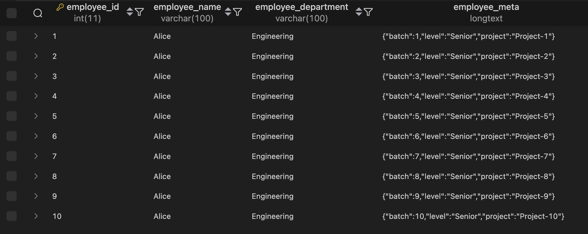
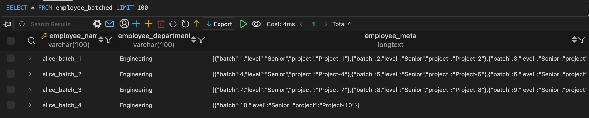

# Hello Docker with MariaDB (Golang CLI App)

This project is a simple Go application that demonstrates how to perform **basic Create and Read operations** on a MariaDB database using Docker and Docker Compose.

It defines an `Employee` structure with the following fields:

- `EmployeeID` (INT)
- `EmployeeName` (VARCHAR)
- `EmployeeDepartment` (VARCHAR)
- `EmployeeMeta` (LONGTEXT, stores JSON)

The program inserts a sample employee into the database and then reads back all existing records.

---

## 🛠 Requirements

- [Docker](https://www.docker.com/)
- [Docker Compose](https://docs.docker.com/compose/)

---

## 🚀 How to Run

1. **Clone the repository**:

   ```bash
   git clone https://github.com/yourname/hello-docker.git
   cd hello-docker

   ```

2. Build and run the container:

   ```bash
   docker-compose build
   docker-compose run hello
   ```

3. Database Screenshots
   

   
